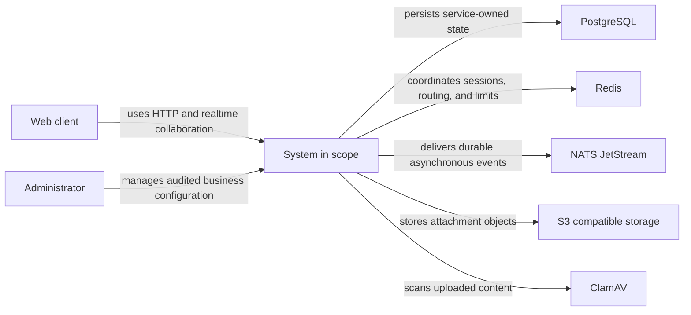
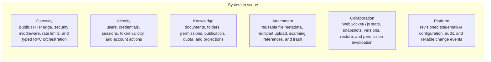

<!-- Generated by Skill Constructor. Edit .skill-constructor/manifest.json through the CLI. -->

# Knowledge-Core: Architecture

Knowledge Core is a knowledge-collaboration backend that separates identity, document metadata, reusable attachments, realtime CRDT collaboration, platform configuration, and edge orchestration behind typed contracts.

## Scope

**In scope**

- Identity and session security
- Document metadata and permissions
- Attachments
- Realtime collaboration and version restore
- Platform-managed business configuration
- HTTP and WebSocket edge orchestration
**Out of scope**

- Cross-service database access
- Exactly-once messaging
- Multi-region session replication
- Hot rebuilding of process topology or infrastructure connections

## Stakeholders and concerns

### Knowledge users

- **concerns**:
  - availability
  - secure access
  - durable content and collaboration

### Operators

- **concerns**:
  - fail-closed readiness
  - observable delivery
  - safe configuration and rollback

### Service developers

- **concerns**:
  - clear ownership
  - typed contracts
  - independent change boundaries

## System context

## Containers

## Architecture principles

### Data ownership

- **description**: Each business service owns its schema and makes final decisions through typed contracts.

### Fail closed

- **description**: Security, authorization, readiness, and critical dependency uncertainty deny work rather than weaken guarantees.

### Durable asynchronous delivery

- **description**: Domain changes and outbox records commit together; consumers are idempotent.

### Explicit composition

- **description**: Dependencies, lifecycles, cleanup, and configuration ownership are visible at process assembly.

## Key flows

### Authenticated request

- **description**: Gateway verifies the token locally, revalidates identity state, and calls the owning service through typed RPC.

### Realtime collaboration

- **description**: Collaboration obtains Knowledge authorization, consumes a one-time ticket, commits Yjs state before broadcast, and projects asynchronously.

### Attachment lifecycle

- **description**: Attachment coordinates multipart storage, malware scanning, references, and retention without transferring document ownership.

### Configuration change

- **description**: Platform commits revision, audit, idempotency, and outbox atomically, then publishes coordinate-only events.

## Quality attributes

### Authorization safety

- **measure**: Protected operations fail closed and no unauthorized session is admitted
- **scenario**: Identity, permission, or routing evidence is unavailable

### Consistency

- **measure**: Domain state and outbox share one transaction and redelivery is idempotent
- **scenario**: A domain write succeeds before asynchronous delivery

### Operability

- **measure**: Its owned listeners, workers, and required dependencies can perform local work
- **scenario**: A process is reported ready

### Evolution

- **measure**: Other services depend only on versioned HTTP/RPC/event contracts, never its tables
- **scenario**: One service changes implementation

## Architecture decisions

### Six service boundaries

- **rationale**: Identity, knowledge, attachment, collaboration, platform configuration, and edge concerns have distinct ownership and scaling behavior.
- **tradeoffs**:
  - More operational components
  - Cross-boundary workflows require RPC or messaging

### Schema-per-service

- **rationale**: Persistence ownership stays enforceable even on one PostgreSQL instance.
- **tradeoffs**:
  - No cross-service SQL joins
  - Distributed consistency must be explicit

### Commit before collaboration broadcast

- **rationale**: Clients must not observe updates that were not durably ordered.
- **tradeoffs**:
  - Write latency precedes fanout
  - Recovery requires snapshots and ordered updates

### Outbox plus JetStream

- **rationale**: Reliable publication is required without a cross-system transaction.
- **tradeoffs**:
  - At-least-once delivery
  - Consumers and redrive operations must be idempotent

## Risks

### Incomplete production acceptance

- **mitigation**: Do not claim production readiness until integration, restore, certificate, rollout, and performance gaps are closed.

### Compatibility windows

- **mitigation**: Track remaining document attachment and configuration-consumer migrations explicitly.

### Distributed contract drift

- **mitigation**: Pin IDL generation, enforce compatibility checks, and fail readiness on critical stream/subject mismatches.

<!-- fact:architecture.design status:verified sources:docs/framework-design.md, Knowledge-Core/.tmp/architecture-design.md, user-confirmed-en-locale-source -->
