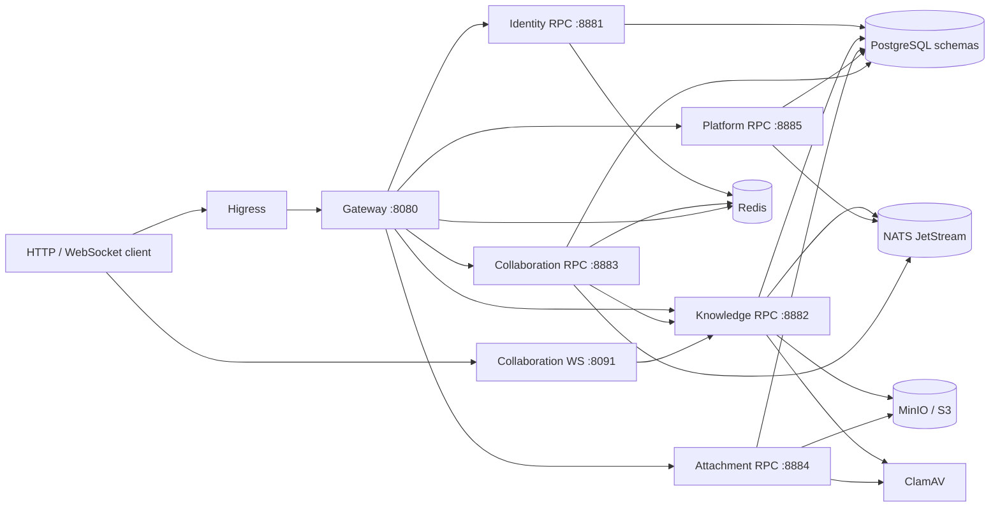
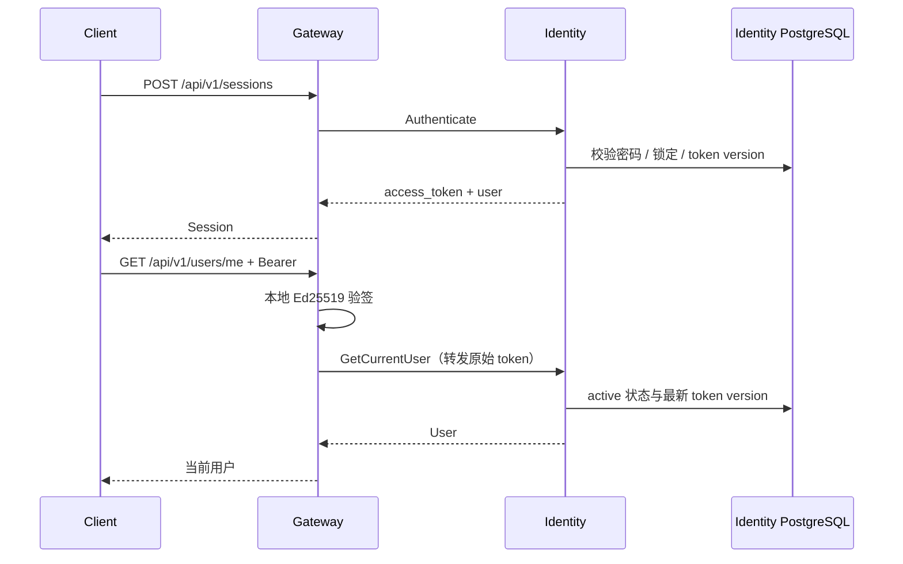
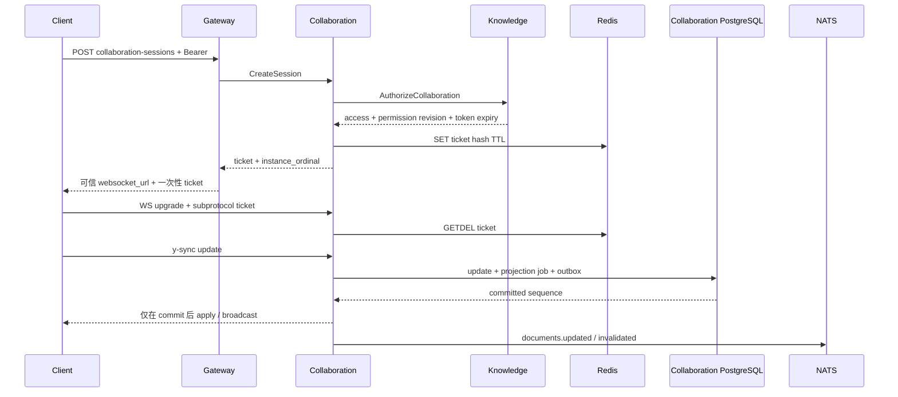

<!-- Generated by Skill Constructor. Edit .skill-constructor/manifest.json through the CLI. -->

# Knowledge-Core: 架构

# Knowledge Core 架构设计文档

> 状态：对照 2026-08-27 工作区代码与已验证文档整理。只描述当前已实现行为。
>
> 权威实现基线：`docs/framework-design.md`。协作细节见 `docs/rust-collaboration-design.md`，附件见 `docs/attachment-service.md`，平台配置见 `docs/platform-configuration.md`，追踪见 `docs/trace-architecture.md`。

## 1. 系统定位

Knowledge Core 是知识协作后端：一个 Go module（`github.com/HappyLadySauce/Knowledge-Core`）加一个 Rust workspace。它对外提供文档元数据、权限、通用附件、实时协作与版本恢复；对内用服务边界隔离数据所有权，禁止跨 schema 直连。

当前实现覆盖：

- 用户注册、密码登录、邮箱验证、密码重置、账户锁定、Refresh Token 轮换、Ed25519 JWT 与用户状态复核。
- 文档元数据、文件夹、成员权限、发布投影、回收站、配额与 outbox。
- 通用附件 multipart 上传、ClamAV 扫描、引用与回收；文档级附件仍处于兼容窗口。
- Yjs update 持久化、快照压缩、手工/自动版本、恢复、多实例同步与权限失效。
- Gateway 严格输入边界、安全中间件、限流、稳定错误映射与上游编排。
- 管理员可写的站点、邮件、AI 配置：修订控制、敏感值加密、审计与可靠变更事件。

当前明确不提供：

- JWKS、JWT 在线密钥轮换、多区域会话复制。
- 跨服务数据库事务、exactly-once 消息、同步全局强一致性。
- 连接、证书、进程拓扑等基础设施配置的热重建。
- 邮件/AI 业务服务对配置事件的完整热加载闭环（Platform 已可靠发布事件）。
- 任意服务共享数据库模型，或绕过公开/内部契约直连其他服务 schema。

## 2. 总体结构



协议分层：

| 边界 | 协议 | 实现 |
| --- | --- | --- |
| 公网 HTTP | Hertz，契约源 `idl/http/v1/gateway.thrift` | Gateway |
| 实时协作 | Axum WebSocket + Yrs + 标准 y-sync | Collaboration |
| 内部同步 RPC | Thrift / TTHeader；Go 用 Kitex，Rust 用 Volo | 全部业务服务 |
| 异步事件 | NATS JetStream | Knowledge、Collaboration、Platform、Identity 配置消费 |

内部 RPC 客户端一律使用静态 `host:port` 与系统 DNS（k3s ClusterIP FQDN 或 Compose 服务名）。进程不向注册中心报名，也不 watch EndpointSlice。生产环境拒绝 localhost / 环回拨号。

## 3. 服务目录与数据所有权

六个显式组装的服务。所有权规则：谁拥有数据，谁负责持久化与最终决策；其他服务只能走 typed RPC。

| 服务 | 语言 / 入口 | 拥有的数据 | 必需依赖 | 不拥有 |
| --- | --- | --- | --- | --- |
| Gateway | Go；public `:8080`，admin `:8082` | 无业务库 | Redis；Identity / Knowledge / Collaboration / Attachment / Platform Kitex 客户端 | 任何领域表 |
| Identity | Go；RPC `:8881`，admin `:8081` | PostgreSQL `identity` schema：用户、凭据、会话、邮件 outbox | PostgreSQL、Redis；可选消费 Platform 邮件配置 | 文档、附件、协作状态 |
| Knowledge | Go；RPC `:8882`，admin `:8083` | PostgreSQL `knowledge` schema：文档、文件夹、成员、投影、配额、outbox；旧文档附件兼容窗口 | PostgreSQL、NATS、S3、ClamAV、Identity RPC、Collaboration RPC | Yjs 二进制、通用附件对象 |
| Attachment | Go；RPC `:8884`，admin `:8085` | PostgreSQL `attachment` schema：统一文件元数据、分片上传、扫描、引用、回收站 | PostgreSQL、MinIO、ClamAV | 文档权限、协作 CRDT |
| Collaboration | Rust；WS `:8091`，RPC `:8883`，admin `:8084` | PostgreSQL `collaboration` schema：Yjs update / snapshot / version / projection job / outbox | PostgreSQL、Redis、NATS、Knowledge RPC | 文档权限规则、用户凭据 |
| Platform | Go；RPC `:8885`，admin `:8086` | PostgreSQL `platform` schema：配置快照、修订、审计、幂等、outbox、投递状态 | PostgreSQL、NATS JetStream | 进程启动与基础设施连接配置（仍归 Nacos） |

所有权硬约束：

- Gateway 是 HTTP edge，不持久化领域数据，不直连任何业务 schema。
- Identity 只拥有用户与 token version；其他服务通过 Identity RPC 取当前用户或解析成员用户名。
- Knowledge 拥有文档元数据、成员、公开投影、文件夹、幂等记录和 outbox；不保存 Yjs 二进制或版本。
- Attachment 拥有可复用文件资源；业务服务通过 RPC 管理引用，不得跨服务直写附件表。
- Collaboration 拥有协作状态与版本；创建 session 时通过 Knowledge RPC 复核访问级别。
- Platform 拥有网页管理员可写业务配置；Gateway 只提供 HTTP façade。Nacos 继续拥有监听地址、依赖 endpoint、证书路径、连接池等部署配置，两类配置互不覆盖。
- `pkg/` 只承载与业务无关的跨服务能力，禁止导入 `services/*`。

## 5. 依赖装配

Go 服务用 `pkg/app.Spec[C]` 注册配置、runtime options 和 `Register`。`Register` 内调用 `NewServiceContext`：构造函数校验必需依赖并返回 `(T, error)`。资源成功创建后立即 `Runtime.AddCleanup`；注册失败则同步关闭刚创建的资源。请求路径不使用全局 Viper、全局连接或隐藏式 DI。

```text
Identity
  PostgreSQL -> GORM migration -> User/Session/Action repository
  -> register / authenticate / session / get-user logic
  -> Kitex RPC + Hertz admin
  Redis；可选 Platform 配置消费者 + 邮件 worker

Knowledge
  PostgreSQL -> 版本化 SQL migration -> Store
  -> document / member / attachment / folder / collaboration logic
  Identity Kitex client（静态 host:port）
  NATS JetStream + S3 + ClamAV + Collaboration Kitex client
  -> workers（outbox / 扫描 / purge）
  -> Kitex RPC + Hertz admin

Gateway
  Redis 限流
  -> Identity / Knowledge / Collaboration / Attachment / Platform typed Kitex clients
  -> JWT 验签 + HTTP middleware / handlers
  -> Hertz public + Hertz admin

Attachment
  PostgreSQL -> SQL migration -> Store
  MinIO multipart + ClamAV 扫描 worker
  -> Kitex RPC + Hertz admin

Platform
  PostgreSQL -> SQL migration -> configuration Store
  -> 修订 / 审计 / 幂等 / outbox 同一事务
  -> JetStream publisher + 投递状态
  -> Kitex RPC + Hertz admin

Collaboration
  SQLx migration + Redis ticket/routing + NATS JetStream
  -> Knowledge Volo client（StaticDiscover）
  -> document actors
  -> Axum WebSocket / admin + Volo RPC
  -> version / projection / outbox / permission workers
```

## 6. 外部 HTTP 契约

契约源：`idl/http/v1/gateway.thrift`。成功响应直接返回资源或分页对象，不使用 envelope。失败响应为 RFC 9457 `application/problem+json`，含稳定 `code`、`key`、`request_id`，可用时含 `trace_id`。未知内部错误不暴露 cause、SQL、地址或堆栈。

| 范围 | 路由 |
| --- | --- |
| 健康 | `GET /health/live`、`GET /health/ready` |
| 用户 / 会话 | `POST /api/v1/users`、`POST /api/v1/sessions`、refresh / logout / 列会话 / 撤销 |
| 邮箱与密码 | email-verification、password-reset、账户停用 |
| 当前用户 | `GET /api/v1/users/me` |
| 公开文档 | `GET /api/v1/documents`、`GET /api/v1/documents/:slug` |
| 站点 | `GET /api/v1/site-profile` |
| 管理员配置 | `/api/v1/admin/configuration/:namespace` 及 deliveries |
| 通用附件 | `/api/v1/attachments` CRUD、complete、restore；content 返回 `303` |
| Studio 文档 | `/api/v1/studio/documents` 列表 / 创建 / 读取 / 更新 / 删除 / 发布 |
| 文件夹 | `/api/v1/studio/folders` |
| 成员 | `/api/v1/studio/documents/:document_id/members` |
| 版本 | `/api/v1/studio/documents/:document_id/versions` |
| 协作会话 | `POST /api/v1/studio/documents/:document_id/collaboration-sessions` |
| 文档附件（兼容） | `/api/v1/studio/documents/:document_id/attachments` |
| 回收站 | `/api/v1/studio/trash` |

HTTP 规则：

- 需要 body 的请求必须 `Content-Type: application/json`。统一走 `pkg/codec/json`，拒绝未知字段、多余 JSON 值、非法数字、未知 query、重复关键 header/query、非法 path。
- Studio 路由与 `/users/me` 必须认证。公开文档允许匿名读取；携带有效 token 时可返回调用方可见的访问上下文。
- 文档、成员、文件夹、配置写操作使用强 ETag，格式 `"<revision>"`；调用方必须原样放入 `If-Match`。
- 支持幂等的创建 / 恢复使用 `Idempotency-Key`（1–128 个可见 ASCII）。
- 分页 `cursor` 是 opaque token。
- 附件下载返回 `303 See Other` 与短期预签名 `Location`，不代理对象正文。
- 响应中的公开 HTTP / WebSocket URL 只来自已校验配置，不信任请求 `Host`。

Gateway 中间件顺序：tracing → metrics → 依赖注入 → panic recovery → access log → 安全头 → CORS → 全局限流 → 可选认证；Studio 路由再强制认证。可信代理 CIDR 为空时不解析转发地址。Redis 固定窗口限流默认全局 `300/min`，注册 / 登录额外 `20/min`。Redis 或身份复核异常时 fail closed。

## 7. 内部 RPC 契约

契约源：`idl/rpc/v1/*.thrift`。生产 RPC 双向验证 mTLS，经 TTHeader 传播 deadline、request ID、W3C trace 与必要的敏感 token metadata；token 永不进入日志或 telemetry。

| 服务 | 关键方法 | 错误码段 |
| --- | --- | --- |
| Identity | `Register`、`Authenticate`、`RefreshSession`、邮箱/密码动作、会话撤销、`GetCurrentUser`、`ResolveUser` | `20xxx` |
| Knowledge | 文档 CRUD / 发布 / 回收、文件夹、成员、兼容附件、`AuthorizeCollaboration`、`ProjectCollaboration` | `30xxx` |
| Attachment | `CreateAttachment`、`CompleteAttachment`、列表 / 读取 / trash / restore | `31xxx` |
| Platform | `GetSiteProfile`、配置读写、投递查询、消费者快照与 apply 回报 | `32xxx` |
| Collaboration | `CreateSession`、版本列表 / 创建 / 详情 / 恢复、`PurgeDocument` | `40xxx` |

协作相关内部语义：

- Knowledge `AuthorizeCollaboration`：从可信 metadata 取 access token，返回 actor、`viewer|editor|owner`、permission revision、token expiry。
- Knowledge `ProjectCollaboration`：按 document generation 与单调 sequence 更新公开 rich-text 投影。
- Knowledge `Ping` 返回本进程 readiness（PostgreSQL、NATS、S3、ClamAV），不探活对端。`Live` 只证明进程存活。
- Collaboration 除 `Ping` 外的业务 RPC 先检查完整应用 readiness；not-ready 时统一 `40007 / collaboration.unavailable`，不会调用 Knowledge、ticket、store 或 actor。

出站 RPC 连续失败熔断：阈值 5、打开 5 秒、半开探测 1。超时与连接错误记失败，业务码不记失败。Gateway 将熔断打开映射为 `gateway.dependency_unavailable`（503）。Collaboration 的 authorize / project 在熔断打开时 fail-closed，不得放行未授权会话。

## 8. 关键调用链

### 8.1 登录与身份复核



Access token：Ed25519，默认 15 分钟。issuer `knowledge-core.identity`，audience `knowledge-core.api`。claims 含 subject、role、token version、`iat`/`nbf`/`exp`、随机 `jti`。验证固定 EdDSA、issuer、audience、严格 base64、30 秒时钟偏差。Gateway 先本地验签，再把原始 token 经 Kitex metadata 传给 Identity / Knowledge。依赖异常 fail closed。

密码使用 bcrypt。登录失败计数与 15 分钟锁定由 PostgreSQL 原子更新与行锁维护。Refresh Token 严格轮换，并发请求有 10 秒前序令牌宽限；宽限外复用会撤销会话。

### 8.2 实时协作（commit-before-broadcast）



要点：

- CreateSession 按 `document_id` 的 SHA-256 桶与 Redis 粘性映射分配实例。Gateway 用 RPC 返回的 `instance_ordinal` 与已校验 WebSocket base URL 构造地址。
- 握手路径：`/v1/instances/{ordinal}/documents/{document_id}`。单实例时额外接受 `/v1/documents/{document_id}`。错实例返回 HTTP 404 且不消费 ticket。
- `Sec-WebSocket-Protocol: knowledge-core-yjs-v1, ticket.<opaque>`。ticket 32-byte CSPRNG，Redis 只存 SHA-256，`GETDEL` 单次消费，默认 30 秒、最长 60 秒。
- `session_expires_at` 不得晚于原 access token `exp`。无 token refresh；到期后客户端重新创建 session。
- viewer 只读。owner 始终最高权限；成员仅 `viewer|editor`。Knowledge 做最终授权，Gateway / Collaboration 只消费结果。
- 每个活跃文档由单一 actor 串行拥有 Yrs state、sequence、generation、连接集合与有界 command queue。
- 客户端 update 先在候选 state 校验大小与 rich-text schema，再在 PostgreSQL 事务中写入；只有 commit 成功后才更新共享内存并广播。重复且不改变 state 的 update 不推进 sequence。
- PostgreSQL 是持久事实源。远端实例经 JetStream fanout 接收已提交 update，发现 gap 时从 PostgreSQL 补齐。

权限失效：

- `knowledge.permissions.changed` 携带正的 permission revision，只以 WebSocket `4403` 关闭 revision 更旧的连接。
- 文档失效以 `4409` 关闭整个 actor。
- 失效订阅解析、路由或 ACK 失败时不确认消息并使进程 not-ready；fail closed 后由外部编排重启。

Knowledge 清理 worker 通过 Collaboration `PurgeDocument` 删除协作数据。

### 8.3 通用附件

状态机：`pending_upload → scanning → ready|rejected|scan_parked → trashed → deleted`。

1. `CreateAttachment` 校验 MIME 白名单、文件名与大小，创建 opaque object key，向 MinIO 创建 multipart，返回 16MiB 分片签名 URL。`Idempotency-Key` 按用户与请求摘要持久化。
2. 客户端上传分片后 `CompleteAttachment` 只完成 multipart，不读对象内容。
3. 扫描 worker 流式读取对象，计算 SHA-256 / 大小 / MIME，并送 ClamAV。仅 clean 且声明值一致才进入 `ready`。
4. 存在引用时拒绝 trash。感染对象不会进入可恢复的 ready。扫描异常最多 8 次退避后进入 `scan_parked`。

边界：单文件 1GiB，用户活动配额 10GiB，最多 64 分片。bucket 私有；浏览器只拿短期签名 URL。文档级附件接口仍由 Knowledge 持有兼容窗口，最终应收口到 Attachment 引用。

### 8.4 平台配置

管理员经 Gateway façade 读写 `site` / `email` / `ai`。`PUT` 必须带强 `If-Match` 与幂等键。一次写入在同一 PostgreSQL 事务内完成快照、审计、幂等记录与 outbox。敏感字段（SMTP 密码、AI API key）用 AES-256-GCM 信封加密，KEK 仅从 `PLATFORM_ENCRYPTION_KEK` 注入；AAD 绑定 environment、namespace、revision。

事件：stream `KNOWLEDGE_CORE_CONFIG`，subject `platform.config.changed.v1`。payload 只含坐标、修订与摘要，不含配置值。Gateway 在 Platform 暂不可用时保留旧静态站点配置作降级。Identity 邮件消费者 durable 名为 `identity-email-config-v1`。

## 9. 持久化与一致性

同一 PostgreSQL 实例、按 schema 隔离。k3s 项目库为 `knowledge_core_dev`；Identity、Knowledge、Collaboration、Attachment、Platform 使用独立 role 与各自 schema。禁止跨服务事务。

| 服务 | 迁移 | 一致性手段 |
| --- | --- | --- |
| Identity | 启动时 advisory lock 内增量 GORM migration | 用户状态、一次性令牌、会话撤销、邮件 outbox 同库事务；Refresh 轮换 |
| Knowledge | 显式版本化 SQL | metadata / content / permission 独立 revision；`If-Match` 乐观并发；领域变更与 outbox 同事务，并 `NOTIFY knowledge_workers` |
| Attachment | 显式 SQL | 状态变更走数据库事务与 durable worker |
| Collaboration | SQLx 有序 checksum migration | update sequence 单调；恢复在 actor 内单事务提交 baseline / update / version / head / projection / idempotency / outbox |
| Platform | 显式 SQL | 快照 / 修订 / 审计 / 幂等 / outbox 同事务 |

Knowledge 检索：先用 `UNION` 从 metadata 与 projection trigram GIN 生成去重 document ID，再应用权限、状态、稳定游标排序与宽行读取。文档软删除后进入保留期；worker 依次清理 Collaboration 数据、S3 对象与 Knowledge 记录。

Collaboration compaction 在 document row lock 下重检阈值。快照与 compaction 不改变可恢复语义。首次 migration 遇到未受本历史管理的旧 Node schema 时拒绝启动。

Outbox 规则（Knowledge / Collaboration / Platform 共用语义）：

- 与领域变更同事务落地，并保存受限 W3C propagation headers。
- 以 outbox message ID 作为 JetStream deduplication ID；必须收到 server PubAck 才标记 published。
- 发布失败最多退避 8 次后 parked，保留 message ID 供人工 redrive。
- 消费者按事件 ID / 业务 revision 幂等处理。不能把 Core NATS 接收当成持久化成功。

## 10. 消息契约

Collaboration 是两套文档/权限 JetStream stream 的 owner：

| Stream（默认名） | Subject | 保留 |
| --- | --- | --- |
| `KNOWLEDGE_CORE_EVENTS` | `collaboration.documents.updated`、`collaboration.documents.invalidated` | 24h max age、1 GiB max bytes |
| `KNOWLEDGE_CORE_PERMISSIONS` | `knowledge.permissions.changed` | 24h max age、`max_bytes=-1`（避免文档写入挤掉仍覆盖 ticket TTL 的撤权事件） |
| `KNOWLEDGE_CORE_CONFIG` | `platform.config.changed.v1` | Platform 配置变更 |

共同要求：Limits retention、File storage、DiscardOld、24 小时 duplicate window、1 MiB max message；两个文档相关 stream 名称必须不同。subject / stream / consumer 契约漂移会拒绝 ready。

每个 Collaboration 副本必须配置唯一且重启稳定的 `COLLABORATION_INSTANCE_ID`，以派生 durable consumer，保证 fanout 与未 ACK 重投递。新 permission durable 使用 `DeliverPolicy::All`；以创建 consumer 后读到的 permission stream `last_sequence` 为启动快照，服务端 ACK floor 越过该快照后才允许 ready。retention 已清空剩余集合时要求 `num_pending` 与 `num_ack_pending` 同时为零。

`knowledge.permissions.changed` 与 `collaboration.documents.invalidated` 只用于失效通知，不替代 PostgreSQL 持久化。

## 11. 配置、Secret 与 TLS

Go 服务环境变量前缀：`IDENTITY_`、`KNOWLEDGE_`、`GATEWAY_`、`ATTACHMENT_`、`PLATFORM_`。优先级：

```text
默认值 < 严格 YAML < Nacos ApplicationConfig < 环境变量
```

每个命令持有独立 Cobra flag set 与 Viper 实例；YAML 严格拒绝未知字段。配置文件只保存非敏感值。password、DSN、JWT key、对象存储凭据、NATS/Redis 认证材料只能由环境变量、Kubernetes Secrets 或经 SOPS 加密的 GitOps 清单注入。

Collaboration 静态基线来自默认值，Nacos 可覆盖非敏感字段，`COLLABORATION_*` 最高优先级。

Nacos `3.2.3`：bootstrap 要求 HTTPS endpoint、namespace/group/data ID、每服务 reader 凭据、CA、key ID 与 32-byte KEK。Go 与 Rust 使用同一 AES-256-GCM 信封和坐标 AAD。Data ID 为 `<service>.dynamic.yaml`，格式 `knowledge-core.io/v1beta1/ApplicationConfig`。初始获取失败阻断启动；运行中失联保留 last-good。可在线更新日志级别、Gateway Origin/限流/公开端点、Identity bcrypt/TTL/锁定、Knowledge 预签名 TTL/ClamAV/worker 时序、Collaboration Origin/握手限流/ticket TTL/actor 限制。监听地址、连接池、凭据、固定容量、worker 拓扑不热重建，通过 `knowledge_core_config_restart_required` 报告。

生产强制（代码已约束的部分）：

- Gateway 公开 base URL 必须与 public listener TLS 一致；Collaboration 公开地址必须 `wss`。
- 生产 Collaboration RPC、Knowledge→Collaboration、Collaboration→Knowledge 均要求验证开启的双向 mTLS。
- Collaboration production 要求非空精确 Origin、PostgreSQL 验证 TLS、`rediss`、NATS TLS。
- Knowledge 非 development 禁止自动创建对象存储 bucket。

## 12. 可观测性

一条用户请求的 trace 从 Higress 收到公开 HTTP 开始，经 Gateway、内部 RPC、数据库/缓存、消息生产消费，到 Higress 发送完响应结束。异步路径通过消息 headers 与 outbox 持久化传播，不依赖进程内存。

抑制 trace（仍走日志与 metrics）：`/metrics`、`/livez`、`/readyz`、`/health/live`、`/health/ready`、RPC `Ping`/`Live`、WebSocket ping/pong。JetStream 重投递不为每次 attempt 建新 span。Collector 对错误、parking/DLQ、超过 1 秒的 trace 100% 保留，其余成功 trace 保留 10%。

六个服务各自独立 Prometheus registry，在 admin `/metrics` 暴露。标签只使用路由模板、RPC 方法、状态码、稳定业务码、依赖名。禁止用户 ID、request/trace ID、原始 URL、错误文本、SQL 参数、Redis key、payload。Go 出站熔断暴露 `knowledge_core_rpc_client_circuit_state{dependency,state}`，`state` 仅为 `closed`/`open`/`half_open`。

Gateway CORS 允许 `traceparent`/`tracestate`，不允许浏览器 `baggage`。内部 baggage 总长上限 8 KiB。

## 13. 生命周期与 readiness

Go 长运行组件实现 `Name`、`Serve`、`Ready(context.Context)`、`Shutdown(context.Context)`。Runtime 并发启动组件，listener 与 worker 均 ready 后才设为 serving。长期运行 context 由组件自身持有，不继承装配用 startup deadline。

Readiness 只证明本进程能接自己的活，不对端 RPC 做 Ready 门闩：

| 服务 | Ready 依赖 |
| --- | --- |
| Identity | PostgreSQL、Redis |
| Knowledge | PostgreSQL、NATS、S3、ClamAV |
| Gateway | Redis |
| Attachment | PostgreSQL、对象存储、ClamAV |
| Platform | PostgreSQL、NATS |
| Collaboration | PostgreSQL、Redis ticket、NATS JetStream、actor/workers、三个 listener；permission consumer 必须追平启动快照 |

退出：先 not-ready，再按注册逆序停止入口与 worker，等待在途请求，最后逆序关闭 client / 消息 / 缓存 / 数据库并 flush telemetry。所有启动、shutdown、cleanup、worker operation 都有时间上限。组件未安全退出时不得提前关闭其底层资源。

Collaboration：信号后先 not-ready，再停 RPC 与 WebSocket、关连接与 actor、停 worker/subscription，最后关 Knowledge client、NATS、Redis、PostgreSQL。RPC serve task 非计划退出或 NATS subscription 意外结束会 fail closed，由外部编排重启。

## 14. 部署与交付

端口：

| 服务 | 端口 |
| --- | --- |
| Gateway public / admin | `8080` / `8082` |
| Identity RPC / admin | `8881` / `8081` |
| Knowledge RPC / admin | `8882` / `8083` |
| Collaboration WS / RPC / admin | `8091` / `8883` / `8084` |
| Attachment RPC / admin | `8884` / `8085` |
| Platform RPC / admin | `8885` / `8086` |
| PostgreSQL / Redis / NATS | `5432` / `6379` / `4222` |
| MinIO / console / ClamAV / Prometheus / Tempo | `9000` / `9001` / `3310` / `9090` / `3200` |
| OTel Collector OTLP gRPC / HTTP | `4317` / `4318` |

Kubernetes 三层所有权：

1. `deploy/k3s`（服务器 `/opt/k3s`）：公共基础设施真源（PostgreSQL、Redis、Nacos、NATS、MinIO、ClamAV）。
2. 本仓库 `deploy/<service>/base` 与 `overlay/dev`：各服务工作负载与行为配置。
3. 私有 GitOps：连接配置、SOPS Secret、trust bundle、不可变镜像 digest。

`dev` 是唯一开发分支；`main` 对开发者只读。`.github/workflows/pipeline.yml` 顺序执行：`make ci` → 受影响服务镜像 → GitOps 快照 fast-forward → Argo 健康 → 冒烟 → DeepSeek 中文摘要 → fast-forward `main` → 单一聚合 tag `vMAJOR.MINOR.PATCH`。禁止 force-push / rebase 共享历史。镜像不扫描、不签名。

生成：Kitex `v0.16.2`、hz `0.9.7`（只允许 `hz update`）、thriftgo `0.4.5`、rustc `1.97.1`。`scripts/generated-files.txt` 是生成器所有权唯一清单。IDL 变更必须 `make generate` 并额外运行 `go run ./scripts/idlguard compat-git <merge-base> idl`。

完成定义：每次变更跑 `make ci`；涉及 Go 并发 / 生命周期再跑 `make race`；改 Node 夹具则在 `services/collaboration/interop` 跑 `npm ci && npm run ci`。

## 15. 编码与安全约束

- 构造函数校验依赖并返回 `(T, error)`。禁止 `Must*`、用 panic 表达业务失败、在非进程入口 `os.Exit`。
- 错误补充操作上下文，`%w` 保留 cause，`errors.Is/As` 判断。跨边界使用 `pkg/error` 的 code/key/kind。
- `context.Context`、deadline、request ID、trace 必须端到端传播。
- 每个 goroutine 必须有明确 owner、停止条件、错误回收与等待路径。
- Secret 不得出现在源码、YAML、日志、metric label、span attribute、发布元数据中。
- Rust 必须 rustfmt、clippy `-D warnings`、cargo deny。
- 文档只能描述已实现且已验证的行为。

## 16. 当前验证边界

已覆盖：领域校验、用例、transport 映射、严格 HTTP 输入、JWT、配置、资源关闭、Collaboration commit-before-broadcast、actor 恢复、版本恢复、投影/outbox、双向 Kitex/Volo、Yjs fixture、多实例 JetStream。

仍未宣称生产完成的缺口：

- Identity / Knowledge / Platform 缺少针对真实 PostgreSQL 的自动化集成测试。
- 完整 Compose WebSocket E2E、production image smoke 不是自动门禁。
- Node/Rust 性能基线、依赖 stop/start、备份恢复、证书轮换、切换/回滚、滚动升级尚未完成。
- 邮件与 AI 配置事件消费者尚未完整热加载密钥快照。
- Knowledge 文档附件仍处于向 Attachment 收敛的兼容窗口；富文本图片尚未全部收口为 `attachmentId` 引用 Saga。
- 当前只有 development overlay；单节点集群不作为 production 环境。

因此：本文件描述的是可构建、可测试的当前代码架构，不能据此宣称已完成生产切换或完整生产级验收。

<!-- fact:architecture.design status:verified sources:README.md#knowledge-core, docs/framework-design.md, docs/framework-design.md#9, docs/framework-design.md#knowledge-core, docs/rust-collaboration-design.md#rust-collaboration, Knowledge-Core/.tmp/architecture-design.md, user-confirmed-en-locale-source -->

Knowledge Core 是知识协作后端，包含六个显式组装的服务：Go Gateway、Identity、Knowledge、Attachment、Platform，以及 Rust Collaboration。每个服务拥有自己的 PostgreSQL schema，通过 typed Thrift RPC 访问；Gateway 只做 HTTP 边缘。kubectl context `default` 中的现场证据显示命名空间 `knowledge-core-dev`。当前 context 看不到 production 与 canary。

<!-- fact:architecture.summary status:verified sources:README.md#knowledge-core, deploy/overlay/dev/README.md#development-overlay, docs/framework-design.md#9, docs/framework-design.md#knowledge-core, docs/rust-collaboration-design.md#rust-collaboration, AGENTS.md user-provided repository instructions, user-confirmed, user-confirmed-schema-v2-rerecord -->
