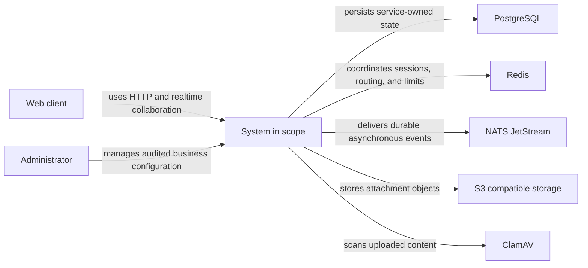
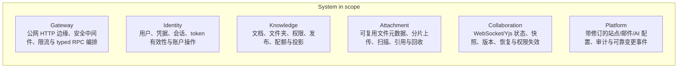

<!-- Generated by Skill Constructor. Edit .skill-constructor/manifest.json through the CLI. -->

# Knowledge-Core：架构

Knowledge Core 是知识协作后端，通过 typed contract 将身份、文档元数据、可复用附件、实时 CRDT 协作、平台配置和边缘编排分开。

## 范围

**包含**

- 身份与会话安全
- 文档元数据与权限
- 附件
- 实时协作与版本恢复
- Platform 管理的业务配置
- HTTP 与 WebSocket 边缘编排

**不包含**

- 跨服务数据库访问
- exactly-once 消息
- 多区域会话复制
- 进程拓扑或基础设施连接的热重建

## 利益相关者与关注点

### 知识用户

- **关注点**：
  - 可用性
  - 安全访问
  - 持久内容与协作

### 运维人员

- **关注点**：
  - fail-closed readiness
  - 可观测交付
  - 安全配置与回滚

### 服务开发者

- **关注点**：
  - 清晰所有权
  - typed contract
  - 独立变更边界

## 系统上下文

## 容器

## 架构原则

### 数据所有权

- **说明**：每个业务服务拥有自己的 schema，并通过 typed contract 作最终决策。

### Fail closed

- **说明**：安全、授权、readiness 和关键依赖的不确定性应拒绝工作，而不是削弱保证。

### 持久异步交付

- **说明**：领域变更与 outbox 记录一起提交；消费者必须幂等。

### 显式组合

- **说明**：依赖、生命周期、清理和配置所有权在进程装配时清晰可见。

## 关键流程

### 已认证请求

- **说明**：Gateway 在本地验证 token、重新核验身份状态，并通过 typed RPC 调用所有者服务。

### 实时协作

- **说明**：Collaboration 获取 Knowledge 授权，消费一次性 ticket，在广播前提交 Yjs 状态，并异步执行投影。

### 附件生命周期

- **说明**：Attachment 负责分片存储、恶意软件扫描、引用和保留，不转移文档所有权。

### 配置变更

- **说明**：Platform 在一个事务内提交修订、审计、幂等和 outbox，然后发布只含坐标的事件。若 namespace 尚未写入，GetConsumerState 返回 DesiredRevision=0 的空闲状态，而不是 NotFound。Identity 在受信任的 mTLS mesh 中读取 Platform consumer 快照并报告应用状态，不使用应用层 service token。

## 质量属性

### 授权安全

- **衡量**：受保护操作 fail closed，不允许未授权会话进入
- **场景**：身份、权限或路由证据不可用

### 一致性

- **衡量**：领域状态与 outbox 共用一个事务，重投递保持幂等
- **场景**：领域写入先于异步交付成功

### 可运维性

- **衡量**：自有 listener、worker 和必需依赖能够执行本地工作
- **场景**：进程被报告为 ready

### 演进

- **衡量**：其他服务只依赖版本化 HTTP/RPC/event contract，从不依赖其表
- **场景**：一个服务改变实现

## 架构决策

### 六个服务边界

- **理由**：Identity、Knowledge、Attachment、Collaboration、Platform 配置和边缘关注点具有不同的所有权与扩缩容行为。
- **权衡**：
  - 运维组件更多
  - 跨边界流程需要 RPC 或消息

### 每服务独立 schema

- **理由**：即使共用一个 PostgreSQL 实例，也能约束持久化所有权。
- **权衡**：
  - 不能跨服务 SQL join
  - 分布式一致性必须显式设计

### 协作广播前提交

- **理由**：客户端不能观察到尚未持久化排序的更新。
- **权衡**：
  - 写延迟先于 fanout
  - 恢复需要快照与有序更新

### Outbox 加 JetStream

- **理由**：在没有跨系统事务时仍需可靠发布。
- **权衡**：
  - 至少一次交付
  - 消费者与 redrive 操作必须幂等

### 由 Mesh 认证的内部 RPC

- **理由**：Attachment publication-reference 和 Platform consumer RPC 是 service mesh 内的受信任后端操作。Istio mTLS 提供工作负载与传输身份，额外的应用 service token 会重复且不一致地划分信任边界。只有方法确实需要用户上下文时才保留 access-token metadata；配置读写方法仍保留管理员 JWT 校验。
- **权衡**：
  - 被受信任 mesh 接纳的任意后端工作负载都可以调用这些方法，包括读取按明确信任决定返回明文的 consumer 配置。
  - 如果 mesh 信任边界改变，必须通过 Istio AuthorizationPolicy/Waypoint 或应用认证增加方法级授权。

## 风险

### 生产验收不完整

- **缓解**：在集成、恢复、证书、发布和性能缺口关闭前，不得声称生产就绪。

### 兼容窗口

- **缓解**：明确跟踪文档附件和配置消费者的剩余迁移。

### 分布式契约漂移

- **缓解**：固定 IDL 生成，强制兼容性检查，并在关键 stream/subject 不匹配时拒绝 ready。

<!-- fact:architecture.design status:verified sources:README.md#knowledge-core, docs/framework-design.md, docs/framework-design.md#9, docs/framework-design.md#knowledge-core, docs/platform-configuration.md#配置同步, docs/rust-collaboration-design.md#rust-collaboration, Knowledge-Core/.tmp/architecture-design.md, user-confirmed-en-locale-source, user-confirmed-internal-rpc-auth-boundary -->
