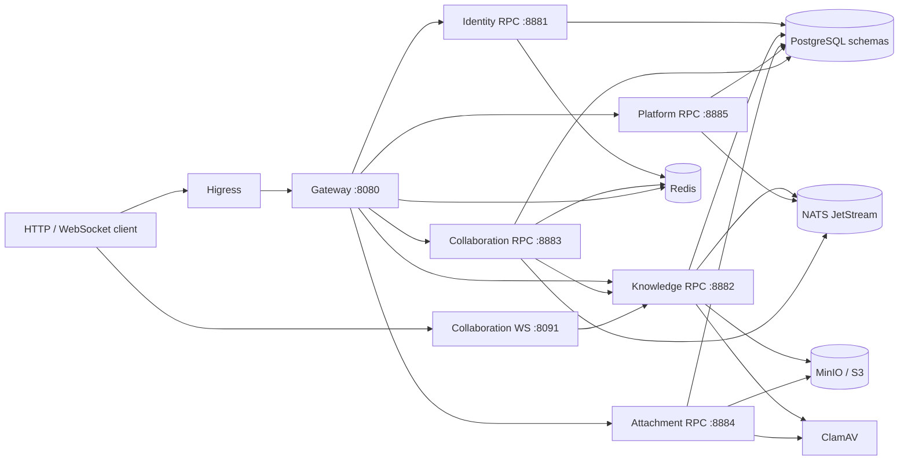

<!-- Generated by Skill Constructor. Edit .skill-constructor/manifest.json through the CLI. -->

# Knowledge-Core: 服务

客户端先到 Higress，再到 Gateway `:8080` 或 Collaboration WebSocket `:8091`。Gateway 通过 Thrift 调用 Identity、Knowledge、Collaboration、Attachment 和 Platform。Collaboration 的 RPC 与 WebSocket 调用 Knowledge 做授权和投影。Knowledge、Identity、Attachment、Platform 和 Collaboration 只持久化在各自的 PostgreSQL schema。异步事件走 NATS JetStream；对象字节走 MinIO/S3；ClamAV 扫描上传。

<!-- fact:services.relationships status:verified sources:user-confirmed-schema-v2-rerecord -->

### Gateway

- **apis**: HTTP idl/http/v1/gateway.thrift GatewayService, health, users/sessions, documents, studio, attachments, admin configuration
- **data**: None; no domain schema
- **dependencies**: Redis, Identity RPC, Knowledge RPC, Collaboration RPC, Attachment RPC, Platform RPC
- **doesNotOwn**: Any domain tables, Yjs state, or object bytes
- **language**: Go
- **ports**: {"admin":8082,"http":8080}
- **role**: Public HTTP edge and admin façade

### Identity

- **apis**: RPC IdentityService: Register, Authenticate, RefreshSession, email/password actions, session revoke, DeactivateAccount, GetCurrentUser, ResolveUser, Ping
- **data**: PostgreSQL schema identity
- **dependencies**: PostgreSQL, Redis, optional Platform email config
- **doesNotOwn**: Documents, attachments, or collaboration CRDT state
- **language**: Go
- **ports**: {"admin":8081,"rpc":8881}
- **role**: Users, credentials, sessions, and token version

### Knowledge

- **apis**: RPC KnowledgeService: document CRUD/publish/trash, folders, members, legacy attachments, AuthorizeCollaboration, ProjectCollaboration, Ping, Live
- **data**: PostgreSQL schema knowledge; legacy document-attachment compatibility window
- **dependencies**: PostgreSQL, NATS JetStream, S3/MinIO, ClamAV, Identity RPC, Collaboration RPC
- **doesNotOwn**: Yjs binaries, generic attachment objects, or user credentials
- **language**: Go
- **ports**: {"admin":8083,"rpc":8882}
- **role**: Document metadata, members, publication, folders, quota, outbox

### Attachment

- **apis**: RPC AttachmentService: CreateAttachment, CompleteAttachment, List/Get, TrashAttachment, RestoreAttachment, Ping, Live
- **data**: PostgreSQL schema attachment
- **dependencies**: PostgreSQL, MinIO/S3, ClamAV
- **doesNotOwn**: Document permission rules or collaboration CRDT state
- **language**: Go
- **ports**: {"admin":8085,"rpc":8884}
- **role**: Reusable file metadata, multipart upload, scan, references, trash

### Collaboration

- **apis**: RPC CollaborationService: CreateSession, version list/create/get/restore, PurgeDocument, WebSocket y-sync on :8091
- **data**: PostgreSQL schema collaboration
- **dependencies**: PostgreSQL, Redis, NATS JetStream, Knowledge RPC
- **doesNotOwn**: Document permission rules or user credentials
- **language**: Rust
- **ports**: {"admin":8084,"rpc":8883,"websocket":8091}
- **role**: Realtime Yjs persistence, versions, restore, multi-instance sync

### Platform

- **apis**: RPC PlatformService: GetSiteProfile, configuration get/put, deliveries, consumer snapshot/apply, Ping, Live
- **data**: PostgreSQL schema platform
- **dependencies**: PostgreSQL, NATS JetStream
- **doesNotOwn**: Process listen addresses, certificates, or connection pools (Nacos)
- **language**: Go
- **ports**: {"admin":8086,"rpc":8885}
- **role**: Admin-writable site, email, and AI configuration

<!-- fact:services.catalog status:verified sources:filesystem:service-definitions, idl/rpc/v1 and architecture-design.md, user-confirmed -->

## 附录

## `entrypoints.catalog`

状态：`verified`

服务进程入口点为 services/gateway/main.go、services/identity/main.go、services/knowledge/main.go、services/attachment/main.go 和 services/collaboration/src/main.rs。服务 main 文件只创建并执行应用命令；Go spec 文件只声明应用规格。辅助可执行入口点包括 scripts/idlguard、Collaboration 的 Rust 代码生成，以及 tools/authkeys、tools/configctl 和 tools/interop。部署定义位于 deploy 和 docker 下。

来源： `filesystem:entrypoint-candidates`, `user-confirmed`, `user-confirmed-en-locale-source`
