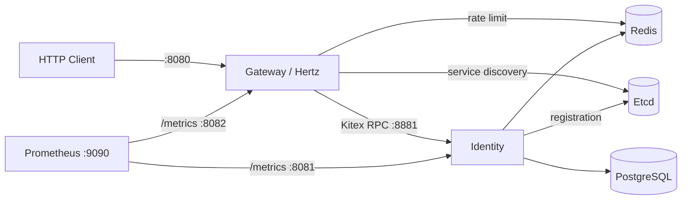

# Knowledge Core

Knowledge Core 是一个正在演进的知识协作后端。仓库目前交付的是认证 MVP：Gateway 提供外部 HTTP API，Identity 通过 Kitex RPC 负责用户、密码与访问令牌，Etcd 提供服务发现，PostgreSQL 和 Redis 承担持久化与运行时状态。

项目仍处于早期阶段。注册、登录和当前用户查询已经可用；文档相关 HTTP 路由虽然已写入 IDL，但当前统一返回 `501 Not Implemented`。`pkg/nats` 和本地 NATS 容器属于框架能力，Identity 与 Gateway 目前都不会连接 NATS。

## 当前能力

| 能力 | 状态 | 说明 |
| --- | --- | --- |
| `POST /api/v1/auth/register` | 已实现 | 创建普通用户，密码使用 bcrypt 保存 |
| `POST /api/v1/auth/login` | 已实现 | 支持用户名或邮箱登录，签发 15 分钟 Ed25519 JWT |
| `GET /api/v1/users/me` | 已实现 | 校验 Bearer JWT，并向 Identity 复核用户状态与 token version |
| 健康检查与 Prometheus metrics | 已实现 | Gateway 和 Identity 均提供独立的管理端口 |
| 文档读取、Studio 与协作写入 | 契约已声明 | 当前所有文档 handler 返回稳定的 HTTP 501 |
| NATS 消息流 | 框架能力 | 公共 adapter 与 Compose 服务存在，当前业务服务未接入 |

登录连续失败 5 次会锁定账户 15 分钟。Gateway 默认按客户端 IP 执行 Redis 固定窗口限流：全局 `300/min`，注册和登录路由额外限制为 `20/min`。

## 技术栈与架构

- Go 1.26.1
- CloudWeGo Hertz、Kitex 与 Thrift
- Sonic 严格 JSON 编解码
- PostgreSQL、GORM、Redis 与 Etcd
- Ed25519 JWT 与 bcrypt
- OpenTelemetry 与 Prometheus



主要目录：

```text
idl/                 HTTP 与 RPC Thrift 契约
kitex_gen/           Kitex 生成代码
pkg/                 跨服务公共运行时、传输与基础设施能力
services/gateway/    外部 HTTP、鉴权、限流与 Identity client
services/identity/   用户领域、认证逻辑、持久化与 RPC server
scripts/             密钥生成、IDL 检查与代码生成
docker/              本地基础设施与 Prometheus 配置
docs/                详细设计文档
```

完整的职责边界、生命周期和安全设计见 [框架设计](docs/framework-design.md)。参与开发前请先阅读 [Agent 开发规范](AGENTS.md)。

## 环境要求

- Git
- Go `1.26.1`
- Docker Desktop 或 Docker Engine，并启用 Compose v2
- GNU Make
- Windows PowerShell 5.1 或 PowerShell 7（以下快速开始使用 PowerShell）
- 可用端口：`2379`、`5432`、`6379`、`8080`、`8081`、`8082`、`8881`、`9090`

仅在修改 IDL 或生成代码时，才需要安装固定版本的 `kitex`、`hz` 和 `thriftgo`；安装命令见[代码生成](#代码生成)。

## PowerShell 快速开始

以下命令均从仓库根目录执行。示例只启动认证 MVP 必需的 PostgreSQL、Redis、Etcd，以及可选的 Prometheus；NATS 不会启动。

### 1. 启动本地基础设施

```powershell
$repo = (Get-Location).Path
$shellPath = (Get-Process -Id $PID).Path
$postgresPassword = Read-Host "请输入本地 PostgreSQL 密码"

$env:KC_POSTGRES_PASSWORD = $postgresPassword
docker compose -f docker/infrastructure/docker-compose.yml up -d postgres redis etcd prometheus
docker compose -f docker/infrastructure/docker-compose.yml ps
Remove-Item Env:KC_POSTGRES_PASSWORD
```

等待 `ps` 中的 PostgreSQL、Redis 与 Etcd 变为 healthy 后继续。Compose 每次读取该文件时都会校验 `KC_POSTGRES_PASSWORD`，因此后续执行 `ps`、`down` 等命令前也要临时设置同一个变量。

### 2. 生成本地认证密钥

下面的命令在内存中保存一对匹配的 Ed25519 密钥，不会创建 `.env` 或密钥文件：

```powershell
$authKeys = @{}
go run ./scripts/authkeys | ForEach-Object {
    $name, $value = $_ -split "=", 2
    $authKeys[$name] = $value
}
$gatewayPublicKey = $authKeys["GATEWAY_AUTH_PUBLIC_KEY"]
```

### 3. 启动 Identity

Identity 需要 PostgreSQL 密码、私钥和对应的公钥。以下命令会打开一个继承这些变量的新 PowerShell 窗口；启动后，当前终端立即移除 Identity Secret。

```powershell
$env:IDENTITY_POSTGRES_PASSWORD = $postgresPassword
$env:IDENTITY_AUTH_PRIVATE_KEY = $authKeys["IDENTITY_AUTH_PRIVATE_KEY"]
$env:IDENTITY_AUTH_PUBLIC_KEY = $authKeys["IDENTITY_AUTH_PUBLIC_KEY"]

Start-Process -FilePath $shellPath -WorkingDirectory $repo -ArgumentList @(
    "-NoExit",
    "-Command",
    "go run ./services/identity --config services/identity/etc/config.yaml"
)

Remove-Item Env:IDENTITY_POSTGRES_PASSWORD
Remove-Item Env:IDENTITY_AUTH_PRIVATE_KEY
Remove-Item Env:IDENTITY_AUTH_PUBLIC_KEY
```

Identity 日志显示 ready 后，在原终端检查：

```powershell
Invoke-RestMethod http://127.0.0.1:8081/readyz
```

期望得到 `status: ok`。如果连接尚未建立，请查看新窗口中的启动错误，不要在 Identity 未 ready 时继续。

### 4. 启动 Gateway

Gateway 只需要同一密钥对的公钥。不要把 Identity 私钥注入 Gateway。

```powershell
$env:GATEWAY_AUTH_PUBLIC_KEY = $gatewayPublicKey

Start-Process -FilePath $shellPath -WorkingDirectory $repo -ArgumentList @(
    "-NoExit",
    "-Command",
    "go run ./services/gateway --config services/gateway/etc/config.yaml"
)

Remove-Item Env:GATEWAY_AUTH_PUBLIC_KEY
$authKeys.Clear()
$gatewayPublicKey = $null
$postgresPassword = $null
$shellPath = $null
```

Gateway 日志显示 ready 后，检查三个入口：

```powershell
Invoke-RestMethod http://127.0.0.1:8081/readyz
Invoke-RestMethod http://127.0.0.1:8082/readyz
Invoke-RestMethod http://127.0.0.1:8080/health/ready
```

两个服务分别运行在新窗口中，可在对应窗口按 `Ctrl+C` 安全退出。

## 调用认证 API

Gateway 严格解码 JSON：字段名或类型错误、未知字段、空 body 和额外 JSON 值都会被拒绝。重复执行注册示例时，请更换用户名与邮箱。

### 注册

```powershell
$baseUri = "http://127.0.0.1:8080"
$password = "local-password-123"

$register = Invoke-RestMethod `
    -Method Post `
    -Uri "$baseUri/api/v1/auth/register" `
    -ContentType "application/json" `
    -Body (@{
        username = "alice"
        email = "alice@example.com"
        password = $password
    } | ConvertTo-Json -Compress)

$register
```

注册成功返回 HTTP `201 Created`。用户名必须为 3–32 个字母、数字、下划线或连字符；密码必须为 8–72 bytes。

### 登录

`identifier` 可以是用户名或邮箱：

```powershell
$login = Invoke-RestMethod `
    -Method Post `
    -Uri "$baseUri/api/v1/auth/login" `
    -ContentType "application/json" `
    -Body (@{
        identifier = "alice"
        password = $password
    } | ConvertTo-Json -Compress)

$token = $login.data.access_token
$login
```

登录响应的 `data` 包含 `user`、`access_token`、`token_type` 和 `expires_at_unix`。

### 查询当前用户

```powershell
$me = Invoke-RestMethod `
    -Method Get `
    -Uri "$baseUri/api/v1/users/me" `
    -Headers @{ Authorization = "Bearer $token" }

$me
```

成功响应统一使用以下 envelope；`trace_id` 只在可用时出现：

```json
{
  "code": 0,
  "message": "ok",
  "data": {
    "id": 1,
    "username": "alice",
    "email": "alice@example.com",
    "role": "user",
    "status": "active",
    "avatar": "",
    "bio": "",
    "created_at_unix": 1710000000,
    "updated_at_unix": 1710000000
  },
  "request_id": "...",
  "trace_id": "..."
}
```

失败响应保持相同的顶层结构，`data` 为空对象，例如：

```json
{
  "code": 10002,
  "message": "invalid request",
  "data": {},
  "request_id": "..."
}
```

## 端口与探针

| 组件 | 默认地址 | 用途与端点 |
| --- | --- | --- |
| Gateway public | `127.0.0.1:8080` | API、`/health/live`、`/health/ready` |
| Gateway admin | `127.0.0.1:8082` | `/livez`、`/readyz`、`/metrics` |
| Identity RPC | `127.0.0.1:8881` | Kitex/Thrift，仅供内部调用 |
| Identity admin | `127.0.0.1:8081` | `/livez`、`/readyz`、`/metrics` |
| PostgreSQL | `127.0.0.1:5432` | Identity 数据库 |
| Redis | `127.0.0.1:6379` | Identity 依赖与 Gateway 限流 |
| Etcd | `127.0.0.1:2379` | Kitex 注册与发现 |
| NATS | `127.0.0.1:4222` | 可选框架能力，当前服务未接入 |
| NATS monitoring | `127.0.0.1:8222` | 仅在启动 NATS 容器时可用 |
| Prometheus | `127.0.0.1:9090` | 本地 metrics 与 `/targets` |

管理端口不应通过公网 ingress 暴露。Prometheus 默认从宿主机的 `8081` 和 `8082` 抓取指标，可访问 `http://127.0.0.1:9090/targets` 查看 target 状态。

## 开发工作流

`dev` 是唯一日常开发分支，所有代码、测试和文档修改都直接提交到 `dev`：

```powershell
git switch dev
git pull --ff-only origin dev
```

不要创建 feature、fix、chore 或 release 等其他开发分支，也不要直接提交或 push `main`。GitHub 会自动创建并合并 `dev -> main` Pull Request；禁止绕过 CI、force-push 或手工强制合并。完整规则见 [AGENTS.md](AGENTS.md)。

常用质量命令：

```powershell
make fmt
make ci
```

- `make ci` 依次检查格式、vet、lint、测试、构建和生成代码漂移，是常规改动的最终本地门禁。
- 修改并发或生命周期代码时，额外运行 `make race`。
- 修改依赖后运行 `make tidy`，并审查 `go.mod`、`go.sum` 差异。
- IDL 兼容检查尚未包含在 `make ci` 中；修改 `idl/` 时必须额外运行：

```powershell
$mergeBase = git merge-base origin/main HEAD
go run ./scripts/idlguard compat-git $mergeBase idl
```

### 自托管 CI Runner

`dev` 的 `verify` job 运行在组织自托管 Linux runner `home` 上，并使用专用的 `Knowledge-Core CI` runner group。该组只授权本仓库；具有仓库写权限的自动 PR、合并和分支同步 job 仍运行在 GitHub 托管 runner 上。

在 GitHub 组织的 **Settings -> Actions -> Runners** 中确认 `home` 显示 `Online` 且标签包含 `self-hosted`、`Linux`、`X64`、`home`。Runner 主机只需提供 `bash`、`git`、Docker CLI 与可用的 rootless Docker daemon；Go、GNU Make、GCC、golangci-lint 和代码生成器全部固定在 [`.github/ci/Dockerfile`](.github/ci/Dockerfile) 中。

workflow 触发后直接执行 [`.github/ci/run.sh`](.github/ci/run.sh)。CI 镜像固定 Go 基础镜像 digest，并按 Dockerfile 内容生成本地 image tag。容器不会挂载 Docker socket，不获得额外 capability，根文件系统只读；仅 workspace 和专用 Go module/build cache 可写。Go module 与工具下载统一使用 `GOPROXY=https://goproxy.cn,direct`，依赖完整性仍由 Go module checksum 校验。仓库不管理 runner、Docker 或代理服务的 systemd 配置。

checkout 前后都会清理仓库 workspace，但不会删除 rootless Docker image 和专用 Go cache。`home` 离线或正在执行其他任务时，`verify` 会在队列中等待，不会自动回退到未授权的机器。不要把 runner 加入宿主机 `docker` 组，也不要在 workflow 中授予 runner 服务账号 sudo。

仓库是 public，但 workflow 不处理 fork pull request，只响应受保护的 `dev`/`main` push 和手动触发。所有能 push `dev` 的成员都能让提交中的代码在 `home` 上执行，因此 runner 必须使用无特权的独立系统账号，不得保存生产 Secret、个人 SSH key，或开放 sudo 与生产网络访问。

## 代码生成

IDL 是 HTTP 与 RPC 契约源。先安装仓库固定的生成器版本：

```powershell
go install github.com/cloudwego/kitex/tool/cmd/kitex@v0.16.2
go install github.com/cloudwego/hertz/cmd/hz@v0.9.7
go install github.com/cloudwego/thriftgo@v0.4.5
```

将 Go 工具目录加入当前终端的 `PATH`，然后执行：

```powershell
$env:Path = "$(go env GOPATH)\bin;$env:Path"
```

随后运行：

```powershell
make generate
make generate-check
```

Windows 也可以直接运行 `./scripts/codegen.ps1` 和 `./scripts/codegen.ps1 -Check`。`scripts/generated-files.txt` 是生成器拥有文件的唯一清单；不要手工修改清单中的文件。Hertz 更新只允许使用仓库脚本中的 `hz update`，不要运行会接管服务目录的 `hz new`。

## 安全与本地数据提示

- 示例配置使用明文 HTTP 和无 TLS 的本地依赖，只适用于本机开发；生产环境必须配置 TLS/mTLS 与 Secret manager。
- PostgreSQL 密码、DSN、JWT 私钥和其他 Secret 只通过环境变量或部署平台注入；JWT 公钥也按服务配置通过环境变量注入。不要把这些值写入 YAML、提交到 Git，或输出到日志、metric label、span。
- Identity 与 Gateway 必须使用同一密钥对的公钥；重新生成密钥后，旧 access token 会立即失效。
- PostgreSQL named volume 只在首次初始化时读取 `KC_POSTGRES_PASSWORD`。已有 volume 不会因修改环境变量而更新密码；请继续使用原密码，或在确认不需要保留本地数据并完成备份后再重建 volume。
- 完整执行 `docker compose -f docker/infrastructure/docker-compose.yml up -d` 会额外启动当前业务未使用的 NATS。Prometheus 不可用不会阻止服务启动或进入 ready。
