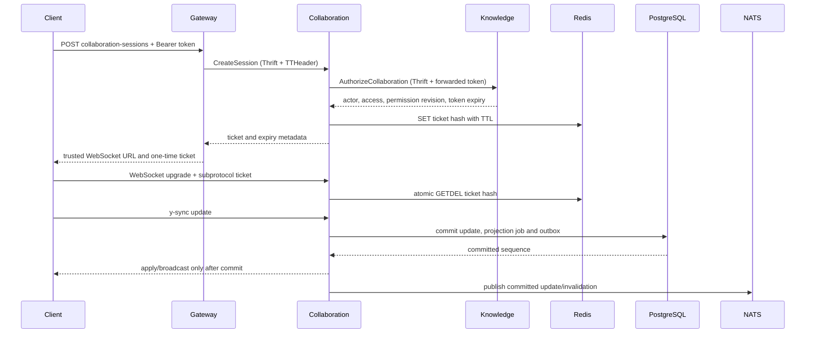

# Rust Collaboration 设计与实现记录

> 状态：方案已在当前工作区实现，尚未执行生产切换。更新于 2026-08-03。
>
> 本文记录 Rust Collaboration 的已实现设计、验证证据和发布门禁。当前代码能力以 [`framework-design.md`](framework-design.md) 为准；性能基线、完整 Compose WebSocket E2E、依赖故障、备份及切换/回滚演练完成前，不得把代码落地描述为已生产切换或完整生产级验收。

## 1. 目标与边界

当前实现使用 Rust/Yrs 替换了 Node/Hocuspocus production 服务，目标和约束是：

- 保留 Yjs/TipTap 客户端生态，服务端改用 Yrs 和标准 y-sync 语义。
- 在确认 PostgreSQL 提交成功后才应用和广播客户端 update，依赖失败时不提供虚假成功。
- 使用与现有 Go 服务一致的 Thrift IDL、TTHeader、Etcd、稳定业务错误和调用链元数据。
- 用显式 owner、有限队列、超时和 join 路径管理连接、文档 actor、worker 与依赖生命周期。
- 补齐 Collaboration 的 Prometheus、OpenTelemetry、真实依赖测试和多实例故障验证。
- 在相同负载下不降低 update 持久化延迟，并显著降低单连接内存成本。

本次重写明确不提供：

- Node internal HTTP、Hocuspocus wire 扩展或旧环境变量的兼容层。
- 旧 `collaboration` schema、Yjs update、快照、版本和任务数据迁移。
- Node/Rust 双写、双读、长期并行部署或旧客户端兼容代理。
- 匿名公开文档的实时 WebSocket；公开阅读继续使用 Knowledge 投影、ETag 和普通 HTTP 刷新。
- Automerge、自研 CRDT 或正式 TypeScript 客户端 SDK。

Identity 与 Knowledge 当前缺少真实 PostgreSQL 集成测试的问题不由本项目扩展处理；Rust Collaboration 自身必须具有真实 PostgreSQL、Redis、NATS 和 Etcd 测试。

## 2. 已确定的技术决策

### 2.1 工具链与核心依赖

- Rust toolchain 固定为 `1.97.1`，由 `services/collaboration/rust-toolchain.toml` 声明，服务 workspace 的 `Cargo.lock` 必须提交。
- 异步运行时使用 Tokio，公开 WebSocket/admin HTTP 使用 Axum 与 Tower。
- CRDT 使用 Yrs；wire 使用 Yjs update v1、y-sync v1 和 awareness，不在服务端引入 JavaScript runtime。
- 内部 RPC 使用 Volo Thrift。基线版本为 `volo 0.12.3`、`volo-thrift 0.12.5`、`volo-build 0.12.3`；其默认 `TTHeader<Framed<Binary>>` 与 Kitex 互通。
- PostgreSQL 使用 SQLx 和显式 SQL migration；Redis 使用异步 client；NATS 使用 `async-nats`；Etcd 使用 `etcd-client`。
- 日志和 trace 使用 `tracing`、OpenTelemetry 与 OTLP；指标使用 Prometheus registry。
- 生产镜像只包含 Rust 二进制和必要 CA/运行库。Node 24 仅保留在最小 Yjs 互操作测试目录及 CI 容器中。

引入依赖时必须固定精确版本、审查默认 feature、禁用不需要的 feature，并通过 RustSec、license、来源和重复版本门禁。禁止为了方便引入另一套配置、日志、HTTP error 或 secret 管理语义。

### 2.2 进程与端口

Rust Collaboration 是一个进程，显式持有三类入口：

| 入口 | 默认地址 | 用途 |
| --- | --- | --- |
| Public WebSocket | `:8091` | `/v1/documents/{document_id}` 的 Yjs 协作连接 |
| Thrift RPC | `:8883` | Gateway/Knowledge 的 session、version 和 purge 调用 |
| Admin HTTP | `:8084` | `/health/live`、`/health/ready`、`/metrics` |

原 Node internal HTTP `:8092` 被删除。公开 TLS 可由服务直接终止或由明确配置的可信 ingress 终止；RPC 在 production 必须使用验证服务端和客户端身份的 mTLS。

## 3. 目标调用链



Gateway 仍是公开 HTTP edge；Knowledge 仍是文档权限与投影的最终所有者；Collaboration 只拥有协作状态、版本和连接。任何服务不得直连其他服务的 schema。

## 4. 公开 API 与 WebSocket 协议

### 4.1 创建协作会话

Gateway 新增：

```text
POST /api/v1/studio/documents/:document_id/collaboration-sessions
Authorization: Bearer <access-token>
```

请求无 body。成功返回 `201 Created`、`Cache-Control: no-store`：

```json
{
  "websocket_url": "wss://collaboration.example.com/v1/documents/018f...",
  "ticket": "<base64url opaque value>",
  "subprotocol": "knowledge-core-yjs-v1",
  "fragment": "default",
  "access": "editor",
  "ticket_expires_at": "2026-08-02T12:00:30Z",
  "session_expires_at": "2026-08-02T12:15:00Z"
}
```

- Gateway 从已校验配置构造 `websocket_url`，不得使用请求 `Host`。
- `ticket` 是 32-byte CSPRNG 随机值的 base64url 表示；Redis key 只包含其 SHA-256，不保存或记录明文 ticket。
- ticket 默认 30 秒过期、最长不得超过 60 秒，并通过 Redis `GETDEL` 原子单次消费。
- `session_expires_at` 不得晚于原 access token 的 `exp`。会话不做 token refresh；客户端在关闭后重新创建 session 并同步 Yjs state。
- owner/editor/viewer 均可创建 session，viewer 的连接只读。认证、Knowledge、Redis 或限流依赖异常时创建失败并 fail closed。
- `DocumentDetailData` 中现有 `websocket_url` 和 `fragment` 被移除，协作入口不再与文档读取响应耦合。

这是明确批准的 breaking API。IDL 实施时仍必须运行 `idlguard compat-git`，并把差异与同窗口客户端升级要求写入迁移记录。

### 4.2 WebSocket 握手

客户端连接 `/v1/documents/{document_id}`，提供两个 `Sec-WebSocket-Protocol` 值：

```text
knowledge-core-yjs-v1, ticket.<opaque-ticket>
```

服务端校验 path、UUIDv7、精确 Origin、连接限流和 ticket 后，只回显 `knowledge-core-yjs-v1`。ticket 不进入 URL、日志、metric label、span attribute 或错误响应；入口代理也必须禁止记录 `Sec-WebSocket-Protocol` 原值。

握手前错误使用 HTTP `400/401/403/429/503`。升级后的稳定关闭码为：

| Code | Reason | 行为 |
| --- | --- | --- |
| `4400` | invalid-protocol / invalid-update | 协议、大小或富文本结构非法 |
| `4401` | session-expired | session 到期或凭据状态失效 |
| `4403` | forbidden | viewer 写入或权限被撤销 |
| `4409` | document-invalidated | 恢复、删除或 generation 变化，必须重连 |
| `4429` | rate-limited / slow-consumer | 有界队列或速率限制触发 |
| `4503` | dependency-unavailable | 持久化、授权或安全失效依赖不可用 |

awareness 不持久化，但必须有独立的消息大小、频率和连接数边界。单次 update、合并文档、节点数量、嵌套深度和 outbound queue 都必须有配置上限；慢消费者被断开，不能反压整个 document actor。

## 5. 内部 Thrift 契约

新增 `idl/rpc/v1/collaboration.thrift`，由 thriftgo 生成 Go Kitex client/server 类型，由仓库 Rust codegen 脚本生成 Volo/Pilota 类型。生成输出必须加入 `scripts/generated-files.txt`，禁止手改或由 `build.rs` 隐式生成。

`CollaborationService` 提供：

- `Ping(common.PingRequest) -> common.PingResponse`
- `CreateSession(CreateSessionRequest) -> CollaborationSession`
- `ListVersions(ListVersionsRequest) -> VersionPage`
- `CreateVersion(CreateVersionRequest) -> Version`
- `GetVersion(GetVersionRequest) -> VersionDetail`
- `RestoreVersion(RestoreVersionRequest) -> Version`
- `PurgeDocument(PurgeDocumentRequest) -> void`

`knowledge.thrift` 增加：

- `AuthorizeCollaboration(AuthorizeCollaborationRequest) -> CollaborationAuthorization`
- `ProjectCollaboration(ProjectCollaborationRequest) -> void`
- `Live(common.PingRequest) -> common.PingResponse`

授权响应必须包含 document ID、actor、`owner|editor|viewer` access、permission revision 和 access-token expiry。公开协作已取消，因此 actor 与 token expiry 都是 required；Collaboration 不复制 Knowledge 权限规则。

Knowledge 的 `Ping` 保持 readiness 语义，`Live` 只返回 `knowledge/live` 且不读取 readiness。Collaboration 启动与 supervisor 使用 `Live`，Gateway 和其他 readiness consumer 继续使用 `Ping`，从而避免 Knowledge 等待 Collaboration ready、Collaboration 又等待 Knowledge ready 的冷启动环。Collaboration 的 `Ping` 与 admin ready 读取同一个完整应用 `HealthState`；其余六个 RPC 都在参数解析和任何 Knowledge、ticket、store 或 actor 副作用之前执行 readiness gate，not-ready 时统一返回 `40007 / collaboration.unavailable`。

TTHeader 必须贯穿：

- `knowledge-core-access-token`：敏感 persistent metadata，只用于可信 RPC 授权转发。
- `x-request-id`：按公共规则生成/校验，不作为 metric label。
- `traceparent`、`tracestate`、`baggage`：W3C trace 传播。
- Kitex/Volo deadline：所有下游 PostgreSQL、Redis、Etcd 和 NATS 调用派生自入口 deadline。

Rust middleware 必须显式提取并向 Knowledge Volo client 转发这些字段，且永不记录 token。业务失败使用 TTHeader BizStatus 和 `40001..40999` Collaboration code/key；Knowledge 的 `300xx` 错误先映射为 Collaboration 的稳定公开语义，未知 cause 不得穿透到 Gateway。

Rust 服务以 `knowledge-core.collaboration` 注册到现有 Etcd prefix。注册 value、lease、weight、tags 和 key 路径与 `pkg/etcd` 当前 Kitex 格式一致；Volo Knowledge client 实现同格式的 `Discover` 和 watch。实例地址严格使用非零端口的 `host:port`，IP literal 直接使用，hostname 在 Etcd snapshot 的总 deadline 内并发解析为排序去重后的 IP 集合；非法地址、DNS 失败、空结果或超时均 fail closed。注册 keepalive 每轮还校验 key、value 与 lease 仍属于本实例；外部删除、覆盖、keepalive 失败或 resolver watch 中止都会使 readiness 失败。

## 6. 文档 actor 与持久化

每个活跃 document 由一个 actor 串行拥有 Yrs `Doc`、当前 sequence、generation、连接集合和有限 command queue。全局 registry 只保存 actor handle；最后连接离开后按有界 idle timeout 回收，回收前等待全部已接收 command 完成。

update 流程固定为：

1. 校验连接权限、frame/update 大小和 command queue 容量。
2. actor 读取数据库中遗漏的 sequence，并在候选 Yrs state 上应用 update。
3. 校验 update 确实改变 state、合并后大小以及 ProseMirror 投影结构。
4. PostgreSQL transaction 对 document 取 row/advisory lock，重新确认 head sequence，写 update、projection job 与 outbox。
5. transaction commit 后更新内存 Doc，并广播给本机连接。
6. outbox worker 有界重试发布 NATS；远端 actor 按 sequence 应用，发现 gap 时从 PostgreSQL 补齐。

commit 前禁止更新共享内存状态或广播。commit 失败时关闭来源连接并依靠客户端本地 Yjs state 在重连后重发。重复、无状态变化的 Yjs update 不创建新 sequence。

目标 schema 从空 `collaboration` schema 建立：

| 表 | 职责 |
| --- | --- |
| `schema_migrations` | 版本化 migration 与校验 |
| `documents` | current sequence、generation、snapshot/version 水位 |
| `updates` | 按 document/generation/sequence 保存不可变 update |
| `snapshots` | 压缩后的完整 Yrs state |
| `versions` | manual/automatic/restoration 不可变版本与创建者快照 |
| `projection_jobs` | 最新目标 sequence、attempt 和 next-attempt |
| `idempotency_keys` | 版本/恢复命令的请求 hash 与过期时间 |
| `outbox` | update、失效和投影事件的 at-least-once 发布 |

migration 在 PostgreSQL advisory lock 下执行，失败则进程不 ready。所有 SQL 必须由 SQLx 显式 transaction 和 deadline 执行；禁止无界 query、连接池等待或 retry。

### 6.1 富文本投影与版本

Rust 实现受限 `XmlFragment("default") -> ProseMirror JSON` codec，覆盖当前允许的 node、mark 和 attribute 集合，并生成 plain text。生产服务不调用 Node；Node/Yjs fixture 仅作为互操作真值。

版本继续保存完整 Yrs state。恢复要求 expected sequence，在 actor 内生成从当前 state 到目标内容的 Yjs update，以普通持久化流程提交，推进 generation/sequence、创建 restoration version、发布失效事件并断开旧连接。恢复不得直接覆盖数据库 head 或绕过 update log。

## 7. 安全、观测与生命周期

- Production 必须使用 `wss`、精确非空 Origin、RPC mTLS、PostgreSQL 验证 TLS、`rediss`、NATS TLS 和 Etcd TLS/认证。
- Secret 只从环境变量或 Secret manager 注入；配置文件只保存非敏感默认值。ticket、JWT、TLS key、DSN、Redis key、payload 和 SQL 参数禁止进入日志与 telemetry。
- Gateway 对 session route 使用认证、按用户/IP 限流和请求体空校验；Rust 对握手、连接、document、update 和 awareness 再执行独立边界。
- Prometheus label 只使用稳定 route/RPC method、status/code、dependency 和 access；禁止 document/user/session/request ID 与原始错误。
- WebSocket session 建立 span 后只记录有界事件；update payload 不进入 span。Thrift、SQLx、Redis、Etcd 和 NATS 延续 request ID、deadline 与 trace。
- NATS permission/invalidation subscription 异常时停止接收新 session、关闭受保护连接并标记 not-ready，不为可用性静默放行；当前恢复策略是由外部编排重启进程，不在进程内无界重连。
- 每个副本的 `COLLABORATION_INSTANCE_ID` 必须唯一且重启后稳定；它用于派生各角色的 JetStream durable consumer identity，使副本间 fanout 与同一副本的未 ACK redelivery 同时成立。
- update、document invalidation 与 permission subject 分别固定为 `collaboration.documents.updated`、`collaboration.documents.invalidated` 和 `knowledge.permissions.changed`；相关环境变量只能等于协议值，不能用于部署级改名。document 与 permission stream 名称可配置但必须不同；两者的 max age 与 duplicate window 都固定为 24 小时并做严格漂移校验。
- document stream 只拥有 update/invalidation subject，并以 1 GiB `max_bytes` 限制历史；permission stream 只拥有 permission subject，`max_bytes=-1`，只按 24 小时 max age 驱逐。permission event 必须包含正 revision；新 durable 使用 `DeliverPolicy::All` 回放全部时间保留历史，以 consumer 创建后读取的 permission stream `last_sequence` 为启动目标，并等待服务端连续 ACK floor 的 stream sequence 越过目标。若 retention 在投递前收缩，只有 consumer 同时没有 pending 和 ack-pending 消息时才视为空集合追平。actor 只关闭 revision 更旧的 session，并用保留时间不短于最大 ticket TTL 的 registry watermark 拒绝事件到达前签发、到达后才消费的旧 ticket。重复或延迟事件不得关闭同 revision/更新授权连接。

所有 background task 必须由 `CancellationToken`、`JoinSet`/task tracker 和 Runtime 统一拥有。启动顺序为配置校验、telemetry、数据库 migration、Redis/NATS/Etcd、Knowledge client、actor/workers、listener、Etcd 注册；每个成功资源立即注册逆序 cleanup。RPC serve task 的返回、错误、panic 与 abort 都必须撤销 listener readiness；只有显式 shutdown/rollback 才标记为计划内退出。RPC task exit 与最终 readiness commit 通过同一同步 gate 串行化，最终 commit 前再次验证 RPC listener，不能在 task 已退出后重新置 ready。

Shutdown 顺序为：先 not-ready 并撤销 Etcd 注册，停止创建 session 和新 WebSocket，等待在途 RPC/update 到上限，关闭连接与 actor，停止 worker/subscription，最后关闭 Knowledge client、Etcd、NATS、Redis、PostgreSQL 并 flush telemetry。任何等待都必须有上限且可测试。

## 8. 配置、仓库和交付

保留 `COLLABORATION_*` 前缀，但不保留旧字段兼容。删除 internal HTTP 和 Knowledge base URL 配置，增加 RPC/admin/Etcd/Knowledge service discovery 与各网络边界 TLS 配置。Gateway 和 Knowledge 的 Collaboration 配置改为 Kitex client + Etcd resolver；Gateway 仍单独持有受信任的 public WebSocket base URL。

当前仓库结构：

```text
services/collaboration/
  Cargo.toml              # package 与 workspace root
  Cargo.lock
  deny.toml
  rust-toolchain.toml
  migrations/
  src/{app,config,domain,rpc,websocket,storage,worker,telemetry}/
  tests/
  interop/                 # 最小 Node/Yjs fixture 与端到端客户端
  tools/rust-codegen/      # Collaboration Thrift/Volo 生成工具
idl/rpc/v1/collaboration.thrift
```

CI 的 Rust 容器完成唯一一次 release build 并写出受检二进制；`docker/collaboration/dockerfile` 只封装该 artifact，最终以固定无特权 UID/GID `10001:10001` 运行且不包含 Rust toolchain、Node/npm。Compose 使用 RPC `:8883`、admin `:8084` 和 Etcd discovery，并已移除 `:8092`。

`.github/ci/run.sh` 使用独立固定 Rust 容器和 cache volume，不修改 `.github/ci/Dockerfile`。根门禁至少包含：

```text
cd services/collaboration
cargo fmt --all --check
cargo clippy --workspace --all-targets --all-features --locked -- -D warnings
cargo test --workspace --all-targets --all-features --locked
cargo build --workspace --release --locked
cargo deny check advisories bans licenses sources
```

Node 24 容器只运行 `services/collaboration/interop` 的 `npm ci` 与互操作测试。生成脚本、`make generate`、`make ci` 和 generated drift check 同时覆盖 Go 与 Rust Thrift 输出。远端真实依赖阶段设置 `COLLABORATION_TEST_REQUIRE_REAL_DEPENDENCIES=1`；PostgreSQL、Redis、NATS 或 Etcd 的对应连接变量缺失时测试直接失败，不允许把 skip 当成通过。

## 9. 测试与验收门禁

### 9.1 当前自动化覆盖

- 单元与 runtime：配置边界、UUIDv7、ticket、错误映射、close code、projection codec、plain text、actor queue、update 去重、恢复与 shutdown。
- PostgreSQL：migration、锁与 sequence、并发 update、snapshot/version、恢复冲突、幂等、projection job、outbox、purge 和 rollback 的真实依赖测试。
- Redis：ticket TTL、hash key、原子单次消费、两个独立连接并发重放和不可用时 fail closed。
- NATS/Etcd：注册/发现、lease/watch、两个不同 instance durable consumer fanout、稳定 instance 重连后的未 ACK redelivery、actor 回收恢复、重复事件与失效路由。
- Kitex/Volo：Go client 调 Rust server、Rust client 调 Go Knowledge，覆盖 TTHeader、Binary、BizStatus、deadline、request ID、trace、token metadata、`Live` 与双向 mTLS。
- Yjs：Node fixture 与 Rust runtime 覆盖 y-sync/awareness、只读 viewer、完整 y-prosemirror schema、投影 JSON、断线重连和恢复。
- 供应链与镜像：固定 lockfile、Clippy、RustSec/license/source，以及 production image 的 UID/GID、无 Node/npm 和配置 fail-fast smoke。

### 9.2 性能门禁

生产切换前，必须从切换前的 Node 基线 commit/镜像在同一 Linux amd64 构建机、同一 PostgreSQL/Redis/NATS 配置和固定数据集补录基线。报告必须记录 commit、镜像 digest、CPU/内存限制、连接数、文档大小、update 大小、持续时间和错误率。

Rust 在相同负载下必须同时满足：

- update commit/可见的 p95 latency 不高于 Node 基线。
- 单稳定 WebSocket 连接内存不高于 Node 基线的 60%。
- 在相同 CPU/内存和错误率上限下，稳定连接密度至少达到 Node 的 2 倍。
- PostgreSQL/NATS 短暂故障后不存在已 commit update 丢失，恢复时间和积压量有界。

性能结果进入独立 benchmark 记录；当前尚无可接受的 Node/Rust 对比证据，未达门禁不得进入切换窗口。PostgreSQL/NATS stop/start、完整 Compose WebSocket E2E、备份恢复和切换/回滚同样尚待演练。

## 10. 实施阶段

| 阶段 | 状态 | 当前结果 |
| --- | --- | --- |
| 互操作探针 | 代码与自动化完成 | Kitex/Volo TTHeader、BizStatus、metadata、mTLS、Etcd 和 `Live` wire 已覆盖；Node 性能基线待补 |
| Rust 骨架与数据层 | 完成 | pinned workspace、配置、telemetry、runtime、migration、repository、真实依赖测试和 admin health 已落地 |
| session 与 WebSocket | 完成 | Gateway session API、Redis ticket、Yrs actor、y-sync/awareness、边界和 commit-before-broadcast 已落地 |
| 版本、投影与多实例 | 完成 | codec、snapshot/version/restore、outbox、JetStream fanout/redelivery/gap recovery 和失效关闭已落地 |
| 调用方与部署代码 | 完成 | IDL/生成物、Gateway/Knowledge Kitex client、Compose、Rust image 已切换，旧 internal HTTP 与 Node production code 已删除 |
| 发布验收 | 未完成 | 最终本地门禁已通过；远端功能阶段有通过记录，但单次完整流水线受外部网络和 production image 构建阻塞，现已暂停远端操作；性能、完整 Compose、故障、备份和切换/回滚演练待执行 |

代码实现与生产切换是两个不同状态；只有前者完成时，文档必须继续保留后者的明确缺口。

## 11. 发布、回滚与完成定义

发布采用单次维护窗口：

1. 禁止创建新 collaboration session，等待现有 Node 连接和 worker 在上限内排空。
2. 备份现有 schema 以支持整栈回滚，然后删除并由 Rust migration 重建 `collaboration` schema；不执行数据转换。
3. 在同一窗口部署 Rust Collaboration、更新后的 Gateway/Knowledge 和新 Web 客户端。
4. 验证 migration、Etcd 注册、Thrift mTLS、session、双客户端编辑、投影、版本、恢复、失效、metrics 和 shutdown。
5. smoke 与 readiness 全部通过后重新开放 session route。

回滚必须先关闭 session route，再整体回滚客户端、Gateway、Knowledge 和 Node Collaboration，并恢复备份或重建旧 schema。Rust 切换后产生的数据不保证回迁，发布公告必须明确这一 RPO。

只有同时满足以下条件才可把迁移记录改为“生产切换完成”：

- Node production service 与 internal HTTP 已删除，生产镜像纯 Rust。
- 新 public/Thrift/WebSocket 契约、生成物、调用方和部署配置一致。
- 正确性、真实依赖、互操作、故障、生命周期、供应链、完整链路和性能门禁全部通过。
- `.github/ci/Dockerfile` 未修改，CI 与本地 `make ci` 可重复通过。
- breaking IDL/API、数据重置、同窗口客户端升级和回滚限制已经记录并演练。

## 12. 主要风险

| 风险 | 控制措施 |
| --- | --- |
| Volo 与 Kitex 的 TTHeader/mTLS/metadata 细节不一致 | 第一阶段只做双向互操作探针，失败则停止后续实现 |
| Yrs 与 Yjs/y-prosemirror 投影不一致 | 使用官方 JS fixture 做逐节点、逐属性和双向 update 契约测试 |
| 多实例并发导致 sequence 或内存 state 漂移 | PostgreSQL 行锁/事务分配 sequence，NATS 只传播已 commit 事件，gap 从数据库补偿 |
| ticket 出现在代理或应用日志 | 不放 URL，只放单次 subprotocol header；代理与 telemetry 强制脱敏，Redis 只存 hash key |
| 单文档 actor 成为热点 | 有界 queue、批量补偿、文档级指标与固定压力门禁；不以破坏顺序换取吞吐 |
| breaking 切换无法局部回滚 | 单窗口整栈部署、切换前备份、明确 RPO，不做混合版本运行 |
