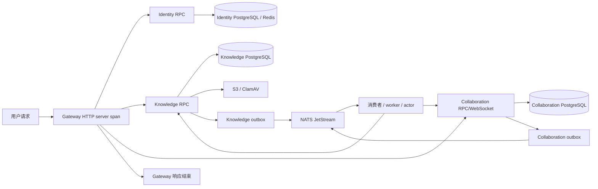

# 链路追踪架构实现说明

> 本文面向开发、排障和交接，描述当前已经落地的链路追踪实现。代码行为或部署方式变化时，请同步更新本文。

## 1. 先记住这一件事

一条用户请求的 trace 从 Gateway 收到 HTTP 请求开始，经过内部 RPC、数据库/缓存、消息生产和消费，最后在 Gateway 完成响应时结束。消息进入异步处理后，trace 不依赖进程内存，而是通过消息 headers 和 outbox 持久化继续传播。



同步调用通常是一条父子 span；异步消息通过 W3C headers 连接生产者和消费者。消费者失败时会重投递，但不会无限扩大 trace。

## 2. 上下文如何传播

| 边界 | 载体 | 实现位置 | 说明 |
| --- | --- | --- | --- |
| 用户 -> Gateway | HTTP headers | `pkg/trace/hertz.go` | 提取/生成 W3C Trace Context，并延续 request ID |
| Go RPC | Kitex TTHeader/metadata | `pkg/trace/kitex.go` | client/server 自动注入和提取 |
| Rust RPC | Volo metadata | `services/collaboration/src/rpc/context.rs` | 从远端 parent 创建 server span，出站调用继续注入 |
| NATS producer -> consumer | 消息 headers | `pkg/nats/propagation.go`、`services/collaboration/src/worker.rs` | 只传 headers，不把 trace 信息写进业务 payload |
| outbox | PostgreSQL JSON 字段 | 两个服务的 outbox repository/migration | 领域事务提交时一起保存传播 headers，进程重启后仍可继续链路 |
| WebSocket -> actor | 握手上下文 | `services/collaboration/src/websocket.rs`、`actor.rs` | 握手提取的 trace context 随连接和每个 frame command 传递 |

传播字段包括：

- `traceparent`、`tracestate`、`baggage`。
- `x-request-id`；Rust 入口还会保留 `x-correlation-id`。
- `baggage` 总长度上限为 8 KiB。超限时丢弃 baggage，避免污染消息和 outbox。

禁止传播 Authorization、Cookie、token、数据库连接串、消息 payload 或用户/文档 ID 等敏感信息。

## 3. Span 结构和命名

排查时按下面的层级看 trace：

| 层级 | Span | 作用 |
| --- | --- | --- |
| 入口 | Gateway HTTP server | 覆盖请求接收、上游调用和响应完成 |
| 同步 RPC | Kitex/Volo client + server | 标记服务边界和 RPC 方法 |
| 基础设施 | GORM、Redis、SQLx 等 instrumentation span | 定位数据库和缓存耗时/错误 |
| 异步生产 | NATS producer | 记录 subject、message ID、事件类型 |
| 异步消费 | NATS consumer | 连接 outbox 事件与实际处理，记录有限 delivery attempt |
| 业务操作 | 文档/协作操作 span | 表达一次逻辑操作，不为每个内部循环创建独立业务 span |

span attribute 只使用低基数字段，例如 route template、RPC method、subject、依赖名、状态码和稳定错误码。不要添加原始 URL、request/trace ID、SQL 参数、Redis key 或 payload。

## 4. 噪音过滤

以下请求完全抑制 trace，但仍通过日志和 metrics 观察：

- HTTP：`/metrics`、`/livez`、`/readyz`、`/health/live`、`/health/ready`。
- RPC：`Ping`、`Live`、`health`、`healthcheck`。
- WebSocket：ping/pong 保活帧。

抑制标记放在 request context 中，并由 span processor 继承处理。因此健康请求下面由 GORM、Redis 等自动 instrumentation 创建的子 span 也会被丢弃。

## 5. 重试、循环和停车

### Go NATS

- 首次投递创建一次 consumer span。
- 重投递 attempt 大于 1 时使用 suppression，避免每次重试生成完整子 span。
- outbox 发布失败按有界退避重试，达到 8 次后进入 parked 状态。
- parking/DLQ 事件保留 message ID、事件类型和稳定失败码，便于从日志、metrics 和存储记录定位。

### Rust Collaboration

- JetStream consumer 最多允许 8 次 delivery。
- 失败消息使用有界 NAK 退避；第 8 次失败后 TERM/parking，不再循环消费。
- `messaging.delivery_attempt` 只记录次数，不记录 payload。
- ACK 失败会让服务变为 not-ready，由外部编排恢复，避免悄悄丢消息。

### 排查原则

先看一次逻辑操作 span，再看它关联的 producer/consumer span；不要把同一个 message ID 的每次 delivery 当成独立用户请求。超过上限的消息应优先检查 parked/DLQ、稳定错误码和依赖 readiness。

## 6. Outbox 与 MQ 的可靠性

领域变更和 outbox 记录在同一个 PostgreSQL 事务中提交。outbox 记录至少包含：

- 事件 ID、事件类型、subject、event key。
- W3C trace headers、request/correlation ID（合法且有界时）。
- 发布尝试次数、最后失败码、parking 时间。

发布成功以 JetStream server PubAck 为准，不能把 Core NATS 接收当成持久化成功。消费者必须按事件 ID或业务 revision 幂等处理；trace headers 只用于观测，不参与业务授权或状态判断。

相关迁移：

- [Knowledge outbox trace migration](../services/knowledge/internal/migration/migrations/003_outbox_trace.sql)
- [Collaboration outbox trace migration](../services/collaboration/migrations/003_outbox_trace.sql)

## 7. Collector、Tempo 和采样

本地 Compose 包含：

| 组件 | 地址 | 作用 |
| --- | --- | --- |
| OTel Collector | `4317` gRPC、`4318` HTTP | 接收服务 OTLP trace，执行 tail sampling |
| Tempo | `http://127.0.0.1:3200` | 本地 trace 查询接口 |

Collector 当前策略：

- 错误 trace：100% 保留。
- 延迟超过 1 秒的 trace：100% 保留。
- 其他成功 trace：10% 保留。
- tail decision cache：15 分钟。

Go 服务通过 `<SERVICE>_TRACE_ENABLED`、`<SERVICE>_TRACE_ENDPOINT`、`<SERVICE>_TRACE_SAMPLE_RATIO` 配置；Rust 使用 `COLLABORATION_OTLP_ENDPOINT`。生产环境的 endpoint、TLS 和鉴权必须由部署平台注入，不能照搬本地地址或把 Secret 写入仓库。

## 8. 一次排障怎么做

1. 从 Gateway 错误响应中的 `trace_id`，或请求日志中的 trace 字段进入 Tempo。
2. 先确认 Gateway server span 是否闭合；若只看到上游 span，检查 Gateway response/handler 是否提前中断。
3. 沿 RPC client/server 查看具体服务，再看数据库/缓存子 span的耗时和错误。
4. 遇到异步断链时，用 `messaging.message.id`、事件类型和 subject 对照 outbox 与 NATS consumer span。
5. 如果有重复 delivery，查看 `delivery_attempt`、最后失败码和 parked/DLQ 指标；不要查看或打印消息 payload。
6. 健康检查没有 trace 是预期行为，应改查 `/readyz`、Prometheus metrics 和服务日志。

## 9. 代码导航

| 需要修改的内容 | 入口文件 |
| --- | --- |
| Go sampler、抑制策略、W3C headers | `pkg/trace/runtime.go`、`pkg/trace/propagation.go` |
| Hertz/Kitex 传播 | `pkg/trace/hertz.go`、`pkg/trace/kitex.go` |
| Go NATS producer/consumer | `pkg/nats/propagation.go`、`pkg/nats/durable.go`、`pkg/nats/delivery.go` |
| Knowledge outbox | `services/knowledge/internal/repository/outbox.go`、`services/knowledge/internal/worker/worker.go` |
| Rust RPC/WebSocket context | `services/collaboration/src/rpc/context.rs`、`websocket.rs`、`actor.rs` |
| Rust NATS/outbox | `services/collaboration/src/worker.rs`、`storage/postgres.rs` |
| 本地 Collector/Tempo | `docker/infrastructure/otel-collector-config.yaml`、`tempo.yaml`、`docker-compose.yml` |

修改这些模块时必须保持：传播字段有界、敏感信息不进 telemetry、重试有上限、outbox 与领域变更同事务、消费者幂等，以及服务 readiness/shutdown 的生命周期约束。

## 10. 交付前检查

```text
make ci
make race       # 修改 Go 并发、worker 或生命周期时执行
git diff --check
```

当前实现不提供 exactly-once 或跨服务全局事务；trace 只能帮助定位最终一致性流程，不能替代业务幂等、补偿和对账机制。
